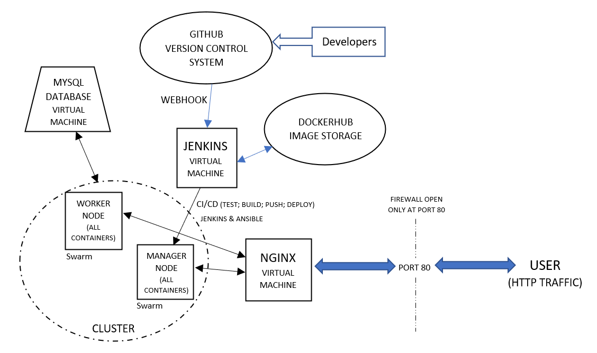

# Prize Project
## Application Overview
### Introduction
> Prize Generator is an application that demonstrates using multiple micro-services in conjunction in order to produce a variable output. In the case of this application, there are 4 micro-services that all work together to determine whether the user is the winner of a virtual gold, silver or bronze medal. 

### Flask micro-services
> The services are set out as follows:
* frontend - this is the service that the user interacts with. It responds to link-clicks and shows the outcome of the attempt submission.
* random_numbers - this is the service that uses the python random.randint standard library module to output a random number between 100 and 999
* random_letters - this is the service that uses random.randint to output a random letter in a pre-defined list
* back-end - this is the service that takes the output of random_numbers and random_letters and determines whether the output was a win and what type of medal if so

### Flask micro-service order of execution
> The flask orchestration of the app works as follows:
1. a user submits an attempt to the front-end
2. the front-end sends a request to the back-end
3. the back-end submits requests to random_numbers and random_letters
4. the back-end takes the request output, determines the outcome and commits the result to the database
5. the user is redirected to the relevant page showing either win or loss

## Setup steps for download
> The source code for the Prize Generator web application can be cloned from [this Github repository](https://github.com/RobLewisQA/Prize_Generator). In order to run the application on Linux Ubuntu 18.04 on your localhost port, ensure that you have Python 3.6 or higher installed, as well as the python installer package, pip3. The following commands should be input in order into your Linux terminal:
1. install docker (sudo apt install curl -y && curl https://get.docker.com | sudo bash)
2. sudo usermod -aG docker $(whoami) [then restart the terminal]
3. install docker-compose - instructions can be found [here](https://docs.docker.com/compose/install/)
4. git init
5. git clone https://github.com/RobLewisQA/Prize_Generator and make sure that you are in this directory
6. docker-compose build
7. docker-compose up -d  

### Development & CI/CD
>This project utilised a variety of Continuous Integration/Continuous Deployment tools in order to automate the journey from development to deployment. From the perspective of the developer, this is the order of execution for the automation pipeline:

* Use GitHub for version control, and use webhooks in conjunction with Jenkins Pipeline so that a git command (eg. push) will execute a new build automatically
2. As set out in the Jenkinsfile, a test stage is executed within a virtual environment, unit-testing and integration-testing each micro-service
3. If the tests are passed, the docker-compose build is executed, creating containers for each service referencing images stoerd in Docker Hub
4. If the new Docker images differ to the ones stored in Docker Hub, the new images are pushed up to the repository there
5. Jenkins then executes the inventory and playbook files which tell Ansible how the swarm must be configured and installs the dependencies depending on the specified role of each machine (node) in the swarm.
6. Jenkins then deploys the swarm of services as a stack

## Technologies used in development
#### Cloud Server Host:
> This web application was designed using a cloud-hosted (GCP) compute machine developed on a Linux Ubuntu 20.10 bootdisk - the most recent with long-term support at the time of writing, and has been tested on Ubuntu 18.04. Earlier or later versions of Ubuntu may cause the app to behave unexpectedly, depending on support for versions of the app's dependencies.  
#### Database format:
> The database is a MySQL5.7 single table database image within a dedicated GCP virtual machine. The app source-code uses SQLalchemy for reading from and writing to the database using python commands.
#### Frontend script:
> The application uses the Flask web-development framework to allow python statements to manage HTML output for the URI routes specified in the routes file. HTML forms are used for the frontend to send post and get requests to the database in the backend. The html templates are constructed using Jinja2 to allow the use of variables in templating construction. The primary modules within Flask used for frontend purposes include render_template, request, url_for and jsonify. These are all installed from the requirements.txt files in each service.
#### Scripting software:
> The logic for the random number generator, random letter generator, backend data handling and frontend logic is scripted using python 3.6. The python requests library, in conjunction with the Flask API is used to send JSON data to specified routes. The Dockerfiles are scripted in GO, the docker-compose.yaml and Ansible scripts use the YAML language and the Jenkinsfile uses Declarative Pipeline (based on the Groovy syntax).
#### Testing software:
> This application was tested using the flask-testing, unittest, pytest, pytest-cov python libraries. The testing thoughouly interrogates the app's logic and configuration, using mock API requests and the SQLite database engine for data-submission testing. The coverage of unit-testing is 100% altogether. This does not reflect the coverage of integration testing which is lower due to issues in some places due to time-out issues with the requests package and the flask API.

> To replicate the testing on a Linux Ubuntu 18.04 or higher, simply run:
1. sudo apt-get install python3-venv
2. python3 -m venv venv
3. source venv/bin/activate
4. pytest random_letters --cov=application 
5. pytest random_numbers --cov=application
6. pytest back-end --cov=application
7. pytest frontend --cov=application
#### Containerisation and cluster configuration software:
> Prize Generator uses a swarm Docker containers across multiple machines (cluster) to provide a seamless continuous integration and deployment experience, ensuring a consistent environment across multiple machines. The cluster for this app consists of a Manager node and a Worker node, where the Manager tells the Worker nodes what to do and builds the images that the Worker nodes will build in their own swarms of containers. Ansible was used in this project development in order to automate the configuration of the cluster, setting out the roles and execution tasks appropriate to each designate node.
#### Deployment software:
> Prize Generator was designed for containerised deployment across 4 virtual machines - each machine's name and role is specified in the Ansible inventory.yaml file, so these must be followed or changed appropriately for Ansible to connect to them. Docker is the containerisation tool used for this application, and Ansible is used with Jenkins to initialise a swarm of a manager node, a worker node and an Nginx node acting as the reverse proxy as well as a load balancer. It is recommended that only the Nginx node be accessible to HTTP traffic - the script design is based on ports 5000, 5001, 5002 and 5003 being inaccessibile to public requests.
>Continuous Deployment utilises a Jenkins pipeline to support automated deployment using Git Webhooks, so that a push to a specified branch of the repository intiates a rebuild of the app on the new source code without bringing the web-app down in the meanwhile. The Jenkins pipeline also pushes the images of containers to a Docker Hub repository before initiating the swarm deployment. This saves build time where the image already exists and can be pulled down from Docker Hub rather than rebuilt each time.
#### Reverse proxy and load balancing:
> Nginx is used in this configuration as the reverse proxy, sitting outside the cluster and does not contain any containers supporting the application service, reducing the risk of unwanted access to micro-services through back doors. The load balancing of traffic to the cluster is also managed by Nginx, transmitting requests made through it to the machine in the cluster with the least traffic, keeping the service fast and responsive.
#### Continous Integration and Version Control:
> The source code for this application is maintained in a Github repository accessible [here](https://github.com/RobLewisQA/Prize_Project), and can be conncted to Jenkins for automatic continuous integration and deployment.

## Configuration

>As the diagram above shows, the user can only access the service through the IP adress of the Nginx machine operating at port 80 (http - denoted by blue arrows). Nginx then reroutes traffic using the internal network (denoted by black arrows) to the Manager and Worker node, both containing the containers of the app in a swarm configuration. The double sided arrows denote that data moves in both direction on the network. The Jenkins machine sits outside the cluster, but is connected to the manager and tells the manager how to manager the cluster based on the Ansible playbook. Jenkins communicates with both GitHub and Docker Hub using regular http requests, and is connected to GitHub via a Webhook, seamlessly integrating CI/CD from the developer/DevOps perspective. The MySQL database is a separate VM, and not in the network, but is connected to the app via a URI link that is managed as a secret in Jenkins for greater security. 

## Database Entity Relationship Diagram
> The database for Prize_Generator consists of one table with the following columns and constraints:

Column | Constraint | Type | Notes
| --- | --- | --- | --- |
 ID | Primary Key, Not Null | INT | Can be used to link tables if another is added to the database |
 rand_number | Not Null | VARCHAR (string) | denotes the output of the two middle services |
 win_lose | Not Null | VARCHAR | Output of backend logic processes to determine if win or lose |
 prize | None | VARCHAR | Output of backend logic to determine prize if win_lose outcome is 'win' |

## Risk Assessment
Description | Evaluation | Likelihood | Impact Level | Responsibility | Response | Control Mearues
| --- | --- | --- | --- | --- | --- | --- |
All application virtual compute machines goes down due to cloud host failure | Application goes offline | Low | High | GCP | Spin up a new vm instance either in GCP or an alternative cloud provider and clone the Github repo to integrate with Jenkins | Keep an up-to-date source code on Github
Application's virtual MySQL machine goes down | Application stays up but database recording fails. All services besides remain in tact | Low | High | GCP | Spin up a new vm instance in GCP and update the configurations with SQLAlchemy and the virtual compute machine | Keep a backup database

The Python language is updated to a new version | The application may not run if Flask and SQLAlchemy are not updated for compatibility | Medium | Medium | Developers | Run the application on Python 3 and phase in an updated version in CI | Keep a robust Github repo so that the source code can be continuously improved and use Jenkins to manage the integration and deployment

Versions of libraries are updated and compatability issues are not mitigated | Some aspects of the application may fail | Medium | High | Developers | Update the requirements.txt to specify the exact versions required | Keep track of planned updates to key libraries, and specify the versions of some of the key libraries required for function

The Nginx machine goes down | Traffic stops getting routed to the app | High | Low | GCP | Spin up a new machine with port 80 open and can be SSH connected to the Jenkins VM | Regularly report on the health of VMs in the cloud and their credit levels

Jenkins installation or pipeline support fails | Jenkinsfile becomes unreadable and deployment must be done manually. Secrets held in Jenkins may cause the entire app to fail if affected | Low | Medium | Jenkins/Google/Linux | With few alterations, the app can work without the database, or the app is able to use a containerised database | Check up on the be ready to spin up a new Jenkins VM and port secrets over. The pipeline isn't difficult to recreate

Run out of money/credit to support a swarm of machines | The deployment can work with only a manager - may need to update the inventory and roles in ansible | Medium | High | Developers | Scale the app down and rely on as few machines as possible, containerising some of the VM functions | Budget for the deployment effectively

Ansible installation fails or changes function critically | The swarm can still be deployed manually, however the automatic CI/CD pipeline with webhooks will be affected | Medium | Medium | GCP/Linux/RedHat | Write bash scripts to automate as much as possible, and do the rest of the deployment manually | Update the Ansible version on the Jenkins machine when key changes are made

An unintentional push to github is made to the webhooks branch | The commit is unlikely to bring the app down, but could reveal valuable data, bugs or backdoors | Depends on the push | Medium | Developers | Revert the GitHub repo and push the change  | Ensure that developers do not have easy access to the branch that triggers webhooks, create a hierarchy of decision making in the company

The logic is changed to a service such that a test is failed | Pytest will exit any jenkins pipeline deployment. If previously deployed, the app should stay up | High | Low | Developers | Ensure that this doesn't prevent needed updates | Execute tests in a virtual environment as be sure that they pass before deploying to the pipeline

The database name or location changes | The app will work, but the environment variable stored in jenkins will be incorrect rendering it unaccessable | Medium | Medium | GCP/Developers | Reconnect to the database at the new address. The data should be held | Check the address of the database occasionally

## Development workflow:
>To see a kanban Trello board of the development process workflow, click [here](https://trello.com/b/h1v0LX39/lottery)

## References:
##### Support working with GitHub WebHooks and Jenkins - https://www.blazemeter.com/blog/how-to-integrate-your-github-repository-to-your-jenkins-project
##### The basis for the docker-compose script, adapted and heavily amended - https://gitlab.com/qacdevops/trio-task
##### Ideas for testing and parsing json from get requests into Jinja2 - https://github.com/KelvinBastow/prizegenerator
##### Script basis for sending the docker-compose file to the Jenkins user - https://github.com/htr-volker/ansible-jenkins/blob/master/jenkins/deploy_stack.sh
##### With thanks to Harry Volker on testing with requests_mock.mock for patching 2 mock get requests outputs simultaneously. The location of a webpage relating to this is unknown, since the inspiration for this came from a video he made.